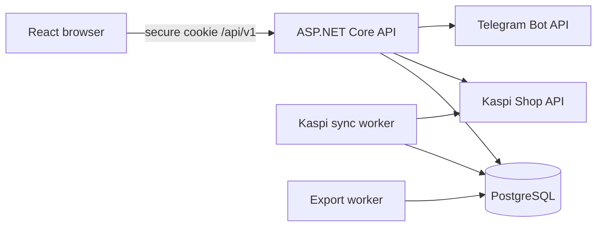
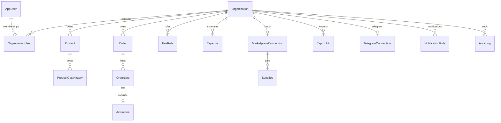

# Architecture and ERD

Tenant isolation выполняется membership-проверкой до business endpoint и обязательным `OrganizationId` predicate при entity lookup. `X-Organization-Id` является только селектором одной из организаций авторизованного пользователя и никогда не считается доказательством доступа.
