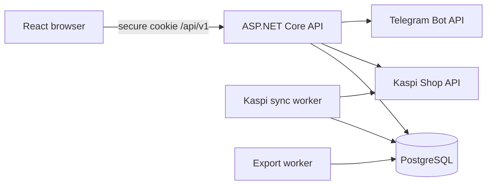
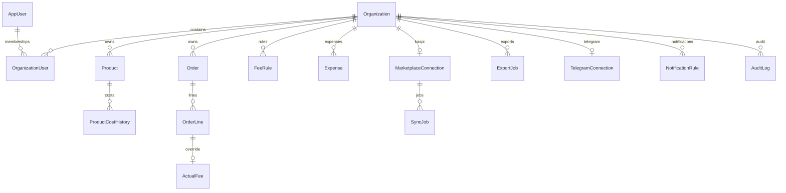

# Architecture and ERD

Tenant isolation выполняется membership-проверкой до business endpoint и обязательным `OrganizationId` predicate при entity lookup. Активная организация хранится как Identity user-claim и попадает в подписанную HttpOnly cookie; клиентские business-запросы не передают tenant. Переключение выполняется отдельным endpoint, который сначала проверяет membership и состояние подписки, затем перевыпускает cookie.
Критические связи дополнительно защищены составными внешними ключами PostgreSQL: connection→orders/sync jobs, order→status history/expenses и product→cost history/expenses/fee rules используют одновременно идентификатор сущности и `OrganizationId`. Поэтому БД отклоняет cross-tenant ссылку независимо от endpoint-кода.
За reverse proxy приложение принимает только один hop `X-Forwarded-For/Proto`, затем включает production HSTS и HTTPS redirect. Внешние auth/invitation URL строятся исключительно от валидированного `PUBLIC_BASE_URL`, поэтому подмена HTTP Host не попадает в письма.

Kaspi adapter классифицирует `401/403`, `429`, сетевые/timeout, `5xx` и повреждённый JSON: фоновые задания получают retry/backoff либо `RequiresAttention`, а не остаются в `Running`. Лимит pagination завершается явной ошибкой вместо тихого усечения заказов. Статусы `CANCELLING`, `KASPI_DELIVERY_RETURN_REQUESTED` и `RETURNED` сохраняются в истории и отражаются как отмена/возврат в финансовых расчётах.

Версионные правила комиссии имеют непересекающиеся включительные периоды внутри одной области (`Default`, конкретный товар или категория). API отклоняет пересечение при создании и изменении даты окончания, поэтому исторический расчёт выбирает единственную применимую версию. Фактическое удержание по строке заказа имеет приоритет над расчётным правилом.

Экспорт «Нет себестоимости» включает как товары без текущей стоимости, так и продажи с неполным историческим Coverage. Текстовые значения CSV с формульными префиксами нейтрализуются перед выгрузкой; XLSX записывает их как текстовые значения. Временный download token хранится только в виде hash, а содержимое выгрузки удаляется после истечения срока.

Telegram bot token остаётся в Render secret. Поскольку Telegram Bot API использует token в URL, для typed `TelegramClient` отключены стандартные `HttpClientFactory` request-логи; worker сохраняет только безопасные error codes. Link code хранится как hash, инвалидируется после успешной привязки, а завершение linking фиксируется в audit log без chat id и секретов.

Subscription maintenance переводит истёкшие `Trialing`/`Active` периоды в `Expired` и создаёт отдельное системное audit-событие для каждой организации. Состояние `Suspended` не перезаписывается автоматикой, чтобы сохранялась семантика административной/платёжной блокировки.
SaaS Admin управляет подпиской отдельно от abuse/security-статуса организации: живой период можно приостановить и возобновить с audit-событием, а возобновление уже истёкшего периода запрещено и требует новой активации тарифа.

Audit trail фиксирует не только изменения бизнес-данных, но и завершение сессии, повторную отправку подтверждения email, проверку Kaspi connection и результат тестовой отправки Telegram. В metadata этих событий сохраняются только технические статусы и безопасные error codes — без токенов, email, chat id и данных покупателей.

Регистрация создаёт Identity user, организацию, Owner membership, subscription, notification rules и первичный audit event в одной транзакции PostgreSQL. Отправка письма выполняется после commit: временный отказ SMTP не откатывает созданный аккаунт, API возвращает `emailDelivered=false`, интерфейс предлагает повторную отправку, а успешные и неуспешные попытки фиксируются отдельными audit events.

Все `/api/v1` ошибки используют `application/problem+json`: endpoint filter нормализует прежние validation/conflict payload, а status-code middleware формирует ProblemDetails для пустых 401/403/404. Ответ содержит HTTP status, безопасный title, request `instance` и `traceId`; успешные контракты не изменяются.

Deployment profile разделяет `Demo`, `Pilot` и `Production`. Demo-seed применяется только по явному `SEED_DEMO_DATA=true`; в Demo отключены Kaspi worker и endpoint подключения/проверки/sync, регистрация требует подтверждения синтетических данных, а UI постоянно показывает предупреждение. Для неизвестного production origin отсутствие `APP_MODE` останавливает startup.
Режимы Pilot/Production fail closed: до подтверждения `DATA_RESIDENCY=KZ`, legal review, backup/restore drill, ротации credentials и обязательного email confirmation readiness возвращает 503, business API не исполняется и background workers не стартуют.

Kaspi, export и Telegram workers используют атомарный conditional claim в PostgreSQL. Только один экземпляр может перевести конкретную запись в `Running`/`Sending`; задания с истёкшим lease восстанавливаются после падения процесса. Частичный уникальный индекс допускает не более одного активного sync job на Kaspi connection, а конкурентная постановка возвращает безопасный conflict вместо дубля.
Kaspi worker дополнительно сверяет `OrganizationId` задания и подключения перед расшифровкой токена; повреждённая или cross-tenant связь переводится в `RequiresAttention` с безопасным кодом и не запускает обращение к marketplace.
