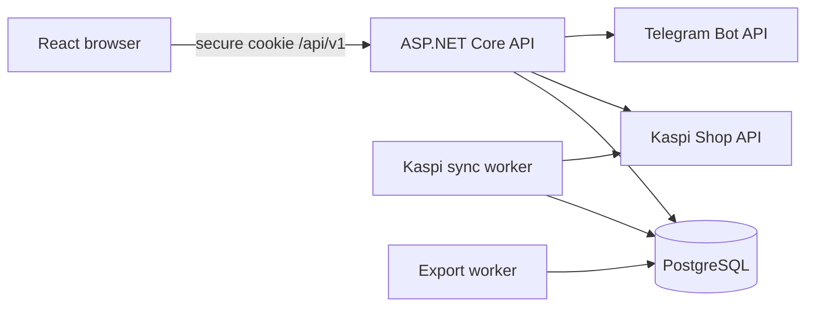
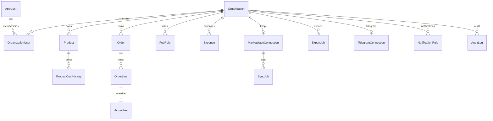

# Architecture and ERD

Tenant isolation выполняется membership-проверкой до business endpoint и обязательным `OrganizationId` predicate при entity lookup. Активная организация хранится как Identity user-claim и попадает в подписанную HttpOnly cookie; клиентские business-запросы не передают tenant. Переключение выполняется отдельным endpoint, который сначала проверяет membership и состояние подписки, затем перевыпускает cookie.

Kaspi, export и Telegram workers используют атомарный conditional claim в PostgreSQL. Только один экземпляр может перевести конкретную запись в `Running`/`Sending`; задания с истёкшим lease восстанавливаются после падения процесса. Частичный уникальный индекс допускает не более одного активного sync job на Kaspi connection, а конкурентная постановка возвращает безопасный conflict вместо дубля.
